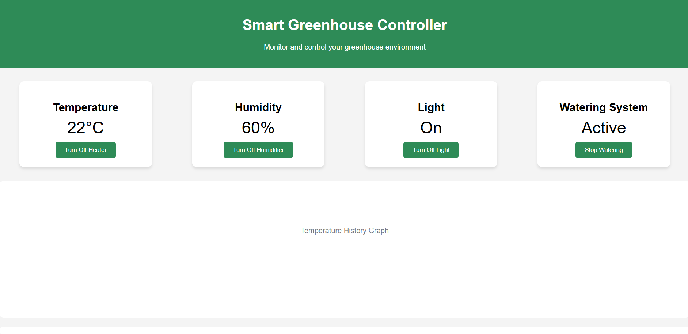
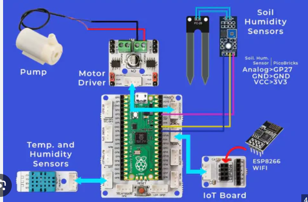
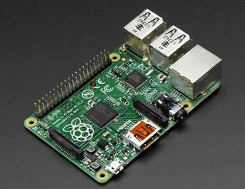
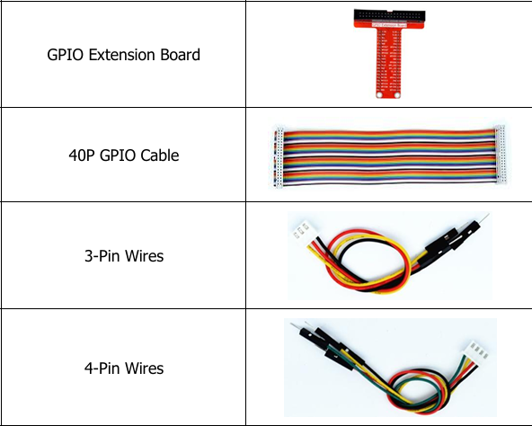
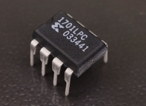
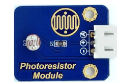
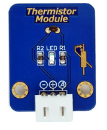
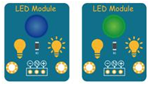
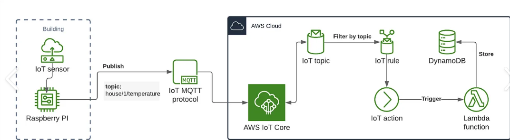

# IOT2-FinalProject
This is the final integration project in IOT2,This project demonstrates an interactive IoT system using a Raspberry Pi to monitor environmental conditions, specifically light and temperature, and respond accordingly with sensor-based actions and real-time data handling, The setup integrates AWS IoT for cloud monitoring.

# Simple mockup of the ThingsBoard

## Project Overview
The IOT project will:  
- Monitor light and temperature levels using connected sensors.
- Process and display data locally and via cloud using AWS IoT.
- Trigger alerts and actions based on preset thresholds (e.g., turning on an LED when temperature 
- exceeds 25°C).
- Republish data if specific conditions are met (e.g., light level thresholds), enabling further analysis and remote access.
  ### 

## Components
### Raspberry Pi: The main microcontroller for managing sensor data and interacting with the AWS IoT.

### Appropriate Cables to make the required conections.

### HVAC system (fan).

### ADC0832 Module: An analog-to-digital converter to capture data from analog sensors.

### Light Sensor: Detects ambient light levels and sends data through the ADC0832.

### Temperature Sensor: Captures temperature, publishing updates through the Pi.

### LED: Indicates when temperature exceeds 25°C or another set threshold.

### AWS IoT Core: Cloud platform to monitor sensor data, set up rules, and manage data republishing.

